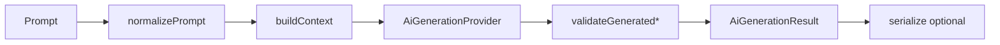

# Builder AI Generation Architecture

Architecture for AI-assisted website generation in Ettajer. **No real AI is implemented** — the stub provider uses keyword-based rules for development and testing.

## Overview

```
Prompt → normalize → build context → provider → validate → AiGenerationResult
                                              ↓
                                    serialize → HomeLayout / BuilderDocument / WebsiteTemplate
```

| Module | Role |
|--------|------|
| `types.ts` | Input/output interfaces |
| `provider.ts` | Provider interface (swap stub for real LLM) |
| `providers/stub-provider.ts` | Deterministic rule-based generator |
| `intent.ts` | Keyword extraction → industry, tone, blocks |
| `compose.ts` | Assemble sections, theme, navigation from intent |
| `validate.ts` | Schema/block registry checks |
| `serialize.ts` | Convert AI output → store formats |
| `generate.ts` | Public API orchestration |

## Usage

```ts
import { generateSite, generatePage, generateSection, generateTheme } from "@/lib/builder/ai";

const result = await generateSite("Create luxury perfume ecommerce website");

if (result.success && result.data) {
  const { pages, navigation, theme } = result.data;
  // pages[0].sections → hero, featured-collections, product-grid, rich-text, footer
  // theme → gold/black/cream luxury palette
}
```

Convert to existing formats:

```ts
import { toHomeLayout, toBuilderDocument, toWebsiteTemplate } from "@/lib/builder/ai";

const layout = toHomeLayout(result.data!.pages[0]);
const doc = toBuilderDocument(result.data!);
const template = toWebsiteTemplate(result.data!);
```

See `examples.ts` for a typed luxury perfume output shape.

## Adding a Real AI Provider

1. Create `lib/builder/ai/providers/openai-provider.ts` (or similar).
2. Implement `AiGenerationProvider`:

```ts
export const openAiProvider: AiGenerationProvider = {
  id: "openai",
  name: "OpenAI",
  async generateSite(prompt, ctx) {
    // Call LLM API, parse JSON into AiGeneratedSite
    // Use ctx.availableBlocks to constrain block IDs
    // Use block settingsSchema keys for content shape
  },
  // generatePage, generateSection, generateTheme ...
};
```

3. Pass the provider to generate functions:

```ts
await generateSite("Create a bakery website", { provider: openAiProvider });
```

The public API (`generatePage`, `generateSection`, `generateTheme`, `generateSite`) stays unchanged.

## Pipeline



## Stub Provider: Luxury Perfume

Input: `"Create luxury perfume ecommerce website"`

| Step | Output |
|------|--------|
| Intent | industry: Fragrance, tone: luxury, siteType: ecommerce, template: fashion |
| Sections | hero → featured-collections → product-grid → rich-text → footer |
| Theme | modern, #1a1a1a / #C9A962 gold, Playfair Display |
| Copy | "Scent of Distinction", heritage brand story |

Luxury perfume prompts bypass the raw fashion template and use `composeSectionsForIntent` for perfume-specific copy and colors.
